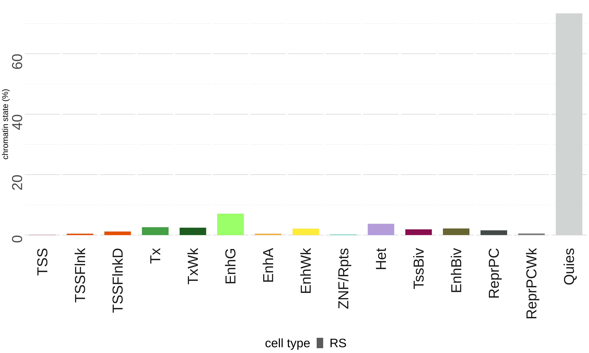
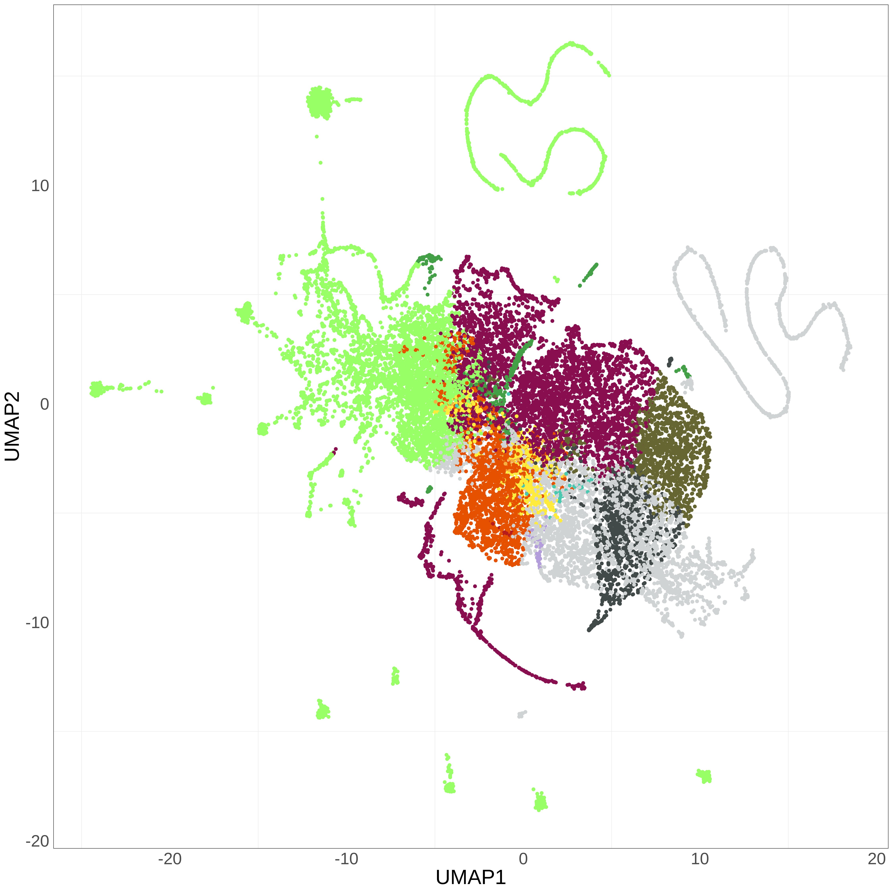

```{r, include = FALSE}
knitr::opts_chunk$set(
  collapse = TRUE,
  comment = "#>"
)
```

# Abstract

ChromENVEE is a package developed to study chromatin states.

This package implements functions to associate all the neighbouring genes to a list of enhancers and to define the chromatin environment of genes using chromatin states informations (e.g., ChromHMM output). Several visualization functions are available to summarize the distribution of chromatin states, characterize genes associated with enhancers and also assign chromatin environment to genes.

# Citation

# Introduction

ChromENVEE (Chromatin ENVrironment and Enhancer-dependent Expression) is a package initially developed to define chromatin dynamics during spermatogenesis and to characterize H3K79me2 at the enhancer level and its chromatin environment. Several recent studies using ChromHMM have shown that H3K79me2 may have a role on gene expression when associated with enhancers (*Ferrari et al*; *Godfrey et al*)

ChromHMM (*Ersnt et al*) is a tool using the Hidden Markov Model (HMM) method to predict the most likely chromatin state of each genomic segment. The tool uses ChIPseq data from multiple epigenetic marks (ChIPseq data) to predict chromatin states, each characterized by one or more epigenetic marks. In the case of this study, six epigenetic marks from 15 different cell types were used to build a model of 18 chromatin states.

The package contains several applications all using the model defined by ChromHMM.
* It allows to characterize the distribution of the chromatin states in a given cell type, thus giving a global idea of the distribution of each chromatin state.
* From the chromatin states defined as enhancers, the package allows the association of potentially regulated genes. It also allows to analyze the expression of genes associated with the enhancers and to visualize the results using several graphical functions.
* From transcriptomic data (RNAseq data), it is possible to determine the chromatin environment of a gene and to estimate the predominant chromatin state.

This package is available for R version >= 3.6.

```{r setup}
# Loading package
library(ChromENVEE)
```

# Data initialization

`colorTable` is a dataframe which gives the following informations: chromain state numbers (`stateNumber`), chromatin state names (`stateName`) and chromatin state colors (`colorValue`). This table is necessary for plot generation. `colorValue` accepts as value hex code and/or color name code.

```{r}
data(colorTable)
```
```{r echo = FALSE, fig.asp = 0.9}
library(grid)
library(gridExtra)
tt = ttheme_minimal(
  core = list(bg_params = list(fill = c(rep("white",36),colorTable$colorValue), col = 1))
)
grid.table(colorTable, theme = tt)
```

`genomeFile` is a dataframe generated from an annotation bed file, in the case of this present study, we used the mouse Ensembl annotation file.

`genomeFile` should contain the following informations: chromosome (chr), gene position (start and end), strand information (strand) and gene name (gene_ENS). Score information is suggested but not mandatory.

```{r}
data(genomeFile)
```
```{r echo = FALSE}
head(genomeFile)
```


`chromatinState` is a dataframe which contains chromatin states information. It is generated with the output of the ChromHMM tool.

`chromatinState` should contain the following informations: chromosome (chr), genomic regions (start and end), chromatin states informations (state and state_name) and sample name (name).

```{r}
data(chromatinState)
```
```{r echo = FALSE}
head(chromatinState)
```

# Distribution of chromatin states in the genome

`plotChromatinState()` calculates the percentage of each chromatin state according to the length of the genome used. We obtain a dataframe with the percentage of coverage for each chromatin state. It is possible to plot the results in `.png` file with the argument `plot = TRUE`. If you have a list of dataframe, it is possible to merge all the dataframe in an unique merged dataframe and in an unique plot with the argument `merge = TRUE`.

```{r}
summary_chromatin_state = plotChromatinState(chromatinState, merge = TRUE, plot = FALSE,
colorTable = colorTable, filename = "")
```
```{r echo = FALSE}
head(summary_chromatin_state)
```
{width=100%}

# Annotation of enhancers


Enhancers are genomic regions that distant (more or less closely) regulate a gene. To know which gene is regulated by the enhancer, we associate at each enhancer, all its neighbouring genes, making the assumption that an enhancer regulates all its neighbouring genes. We focus on enhancer chromatin states (in this study, we have 4 types of enhancers : bivalent enhancers (EnhBiv), genic enhancers (EnhG), active enhancers (EnhA) and weak enhancers (EnhWk)).

`listTableEnhancer` is a GRanges object or a list of GRanges object (producted by [`GenomicRanges`](https://bioconductor.org/packages/release/bioc/html/GenomicRanges.html) package). Similar to `chromatinState` dataframe, `listTableEnhancer` should contain genes and chromatin states informations. Sample name (sample_name) is mandatory if you want to compare enhancer annotation (see [Enhancer annotation comparison](#enhancerlist)).


```{r}
data(listTableEnhancer)
```
```{r echo = FALSE}
listTableEnhancer[[1]]
```

## Association of enhancers to genes

To determine which genes are associated to which enhancers, we assign to each enhancer all the genes located within an interval.
To do that, `enhancerAnnotation()` uses a `GRanges` object.

The function takes few minutes to process depending on the length of your enhancer table. It is possible to multithread the function with the `nCore` parameter. For each enhancer position, we get two informations, distance between gene and enhancer (in bp) and name of gene associate.


```{r}
table_enhancer_gene = enhancerAnnotation(listTableEnhancer[[1]], genome = genomeFile,
interval = 500000, nCore = 1)
```
```{r echo = FALSE}
head(table_enhancer_gene)
```

### Number of genes associated with an enhancer

With the `enhancerAnnotation()` function, each enhancer region can be associated with one or more genes. The function `plotGeneAssociation()` allows to represent the distribution of the number of genes associated with the enhancers. The function uses polynomial linear regression as representation.

```{r, fig.width = 10,fig.asp = 0.5}
plotGeneAssociation(table_enhancer_gene, all = FALSE)
```

## Gene expression information

`geneExpression` is a dataframe which contains gene expression level information.

It is generated with RNAseq gene expression analysis. `geneExpression` should contain the following informations: chromosome (chr), gene position (start and end), gene name (gene_ENS), strand information (strand), level of gene expression (gene_expression). Score is not necessary for the analysis. For gene name, you must use the same gene name you used to generate `genomeFile` dataframe.


```{r}
data(geneExpression)
```
```{r echo = FALSE}
head(geneExpression)
```

`enhancerExpression()` able to associate the level of gene expression to each gene-enhancer pair which is determined with `enhancerAnnotation` function.
It is possible than a gene-enhancer pair does not have an expression level. In this case, the function returns NA value.

```{r}
table_enhancer_gene_expression = enhancerExpression(table_enhancer_gene,
geneExpressionTable = geneExpression)
```
```{r echo = FALSE}
head(table_enhancer_gene_expression)
```

## Visualization of enhancer annotation
### Gene expression associated to enhancers according to gene-enhancer distance

We generated a plot to visualize the level of gene expression according to the distance between a gene and the enhancer to which it is associated, using `plotDistanceExpression`. The distance is estimated with `limit` argument and clusterized in 6 distance groups as visualized in the plot below.

```{r, fig.width = 10,fig.asp = 0.5}
plotDistanceExpression(table_enhancer_gene_expression, colorTable = colorTable,
limit = 500000)
```

### Distribution of gene according to distance between gene and enhancer

We generated a plot to visualize gene distribution according to the distance between a gene and the enhancer to which it is associated, using `plotGeneDistance`. The distance is estimated with `limit` argument and clusterized in 6 distance groups as visualized in the plot below.

```{r, fig.width = 10,fig.asp = 0.3}
plotGeneDistance(table_enhancer_gene_expression, limit = 500000, xlab = "",
ylab = "distance enhancer-gene (bp)")
```

### Expression of gene associated to enhancer

We generated a plot to visualize the distribution of gene expression associated to enhancer using `plotEnhancerExpression`. It is possible to rescale the plot with `scale` argument ('none','log10' and 'log2' are accepted).

```{r, fig.width = 10,fig.asp = 0.4}
plotEnhancerExpression(table_enhancer_gene_expression, scale = "log10",
colorTable = colorTable, ylab = "gene expression log10(CPM)")
```

# Enhancer annotation comparison <a name="enhancerlist"></a>

It is possible to compare different categories of enhancers. To do this, it is necessary to use a list of GRanges objects, each containing data as those in `listTableEnhancer`. Unlike the individual analysis, each GRanges object in the list requires sample information (sample_name).

The first step is to assign to each enhancer all the genes located within an interval using `enhancerAnnotation()`. After gene association, we associate the gene expression at enhancer using `enhancerExpression()`.


```{r}
list_table_enhancer_gene = lapply(listTableEnhancer, enhancerAnnotation,
genome = genomeFile,interval = 500000, nCore = 1)
listTableEnhancerGeneExpression = lapply(list_table_enhancer_gene, enhancerExpression,
geneExpressionTable = geneExpression)
```


This process takes few minutes. To reduce time, you can load the `listTableEnhancerGeneExpression` data to process the following analyses.

`data(listTableEnhancerGeneExpression)`

### Number of gene associate at the enhancer

With the `enhancerAnnotation()` function, each enhancer region can be associated with one or more genes. The function `plotGeneAssociation()` allows to represent the distribution of the number of genes associated with the enhancers. The function uses polynomial linear regression as representation. `all = TRUE` parameter is used to compile all enhancer tables in same '.png' file.

```{r, fig.width = 10,fig.asp = 0.5}
plotGeneAssociation(listTableEnhancerGeneExpression, all = TRUE)
```

### Expression of gene associated to enhancer according to their distance

We generated a plot to visualize the level of gene expression according to the distance between a gene and the enhancer to which it is associated, using `plotDistanceExpression`. The distance is estimated with `limit` argument and clusterized in 6 distance groups as visualized in the plot below. In the case of list analysis, the function shows the expression average associate to each enhancer.

```{r, fig.width = 10,fig.asp = 0.5}
plotDistanceExpression(listTableEnhancerGeneExpression, colorTable = colorTable,
limit = 500000)
```

### Distribution of gene according to distance between gene and enhancer

We generated a plot to visualize gene distribution according to the distance between a gene and the enhancer to which it is associated, using `plotGeneDistance`. The distance is estimated with `limit` argument and clusterized in 6 distance groups as visualized in the plot below.

```{r, fig.width = 10,fig.asp = 0.5}
plotGeneDistance(listTableEnhancerGeneExpression, limit = 500000,
xlab = "", ylab = "distance enhancer-gene (bp)")
```

### Expression of gene associate to enhancers

We generated a plot to visualize the distribution of gene expression associated to enhancer using `plotEnhancerExpression`. It is possible to rescale the plot with `scale` argument ('none','log10' and 'log2' are accepted).

```{r, fig.width = 10,fig.asp = 0.5}
plotEnhancerExpression(listTableEnhancerGeneExpression, scale = "log10",
colorTable = colorTable, ylab = "gene expression log10(CPM)")
```

# Characterization of chromatin states in the gene environment

We want to study and characterize the chromatine states in the gene environment. To do this, we need gene informations data (`geneExpression`) and chromatin states data (`chromatinState`).

```{r}
data(geneExpression)
data(chromatinState)
```

## Coverage of chromatin states in the gene environment

`geneEnvironment()` is a function able to estimate the chromatin state environment of gene. To do this, we estimate an environment with `interval` parameter.

`geneEnvironment()` may take few minutes depending on the number of genes analyzed.

```{r}
table_overlapping = geneEnvironment(geneExpression, chromatinState,
stateOrder = unique(colorTable$stateName), interval = 3000)
rownames(table_overlapping) = table_overlapping$gene_ENS
```
```{r echo = FALSE}
head(table_overlapping)
```

## Predominant state in the gene environment

`predominantState()` estimates the predominant chromatin state in the gene environment.
The function estimates as predominant the chromatin state with the highest coverage in the environment. Genes are clusterized according to their chromatin state using [`umap`](https://cran.r-project.org/web/packages/umap/index.html) package. The function returns a dataframe with information about the predominant chromatin state and UMAP dimension.

```{r}
result_umap = predominantState(table_overlapping, state = unique(colorTable$stateName),
header = unique(colorTable$stateName), neighbors = 32, metric = "euclidean", dist = 0.5)
```
```{r echo = FALSE}
head(result_umap)
```

It is an example of UMAP representation to visualize the predominant chromatin state in each gene. Each point corresponds to a gene and is colored according to its predominant chromatin state.

```
ggplot(result_umap,aes(UMAP1,UMAP2, color = factor(state,
    levels = unique(colorTable$stateName)))) +
	geom_point() +
	scale_color_manual(values = col$stateName) +
	theme_bw() + theme(strip.background  = element_blank(),
		text = element_text(size=25, angle = 0),
		panel.grid.major = element_blank(),
		axis.ticks = element_blank(),
		strip.text.x = element_text(size = 25, angle = 0, hjust = 1),
		legend.position = "none")
```

{width=100%}

# Session Information

Here is the output of `sessionInfo()` on the system on which this document was compiled:

```{r echo = FALSE}
sessionInfo()
```

# References

Ernst J, Kellis M. ChromHMM: automating chromatin-state discovery and characterization. Nature Methods, 9:215-216, 2012

Papier scientifique associé

McInnes, Leland, and John Healy. "UMAP: Uniform Manifold Approximation and Projection for Dimension Reduction." arXiv:1802.03426.

Lawrence M, Huber W, Pagès H, Aboyoun P, Carlson M, Gentleman R, Morgan M, Carey V (2013). “Software for Computing and Annotating Genomic Ranges.” PLoS Computational Biology, 9. doi: 10.1371/journal.pcbi.1003118, http://www.ploscompbiol.org/article/info%3Adoi%2F10.1371%2Fjournal.pcbi.1003118.
