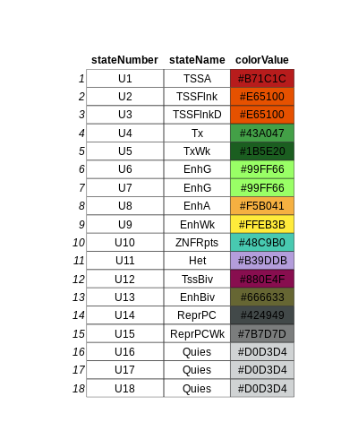

```{r, include = FALSE}
knitr::opts_chunk$set(
  collapse = TRUE,
  comment = "#>"
)
```

# Abstract

Standard analyses on ChIPseq data provide information (annotation, enrichment level) at the gene body level but do not necessarily investigate other genomic regions. ChromHMM R package allows to go further by predicting chromatin states using ChIPSeq datasets for several histone marks. The present R package ChromENVEE uses the chromatin states obtained by ChromHMM and compare them with transcriptomic data (RNAseq) and other ChIP-Seq data.

Specifically, ChromENVEE implements functions to associate all the neighbouring genes to a list of enhancers and to define the chromatin environment of genes using chromatin states informations. Several visualization functions are available to summarize the distribution of chromatin states, characterize genes associated with enhancers and also assign chromatin environment to genes.

# Citation

If you use ChromENVEE in published research, please cite:

- Manon Coulee, Guillaume Meurice, Julie Cocquet\* and Laila El Khattabi\* (2022). ChromENVEE: Chromatin Environment and Enhancer-dependent Expression. R package version 1.1.8.
\*co-authorship

# Introduction

**ChromENVEE** (**C**hromatin **ENV**ironment and **E**nhancer-dependent **E**xpression) is a package that was developed to define chromatin dynamics in a specific cell type and to characterize a histone mark at the enhancer level and its chromatin environment.

ChromHMM (*Ersnt et al, 2012*) is a tool using the Hidden Markov Model (HMM) method to predict the most likely chromatin state of each genomic segment. The tool uses ChIPseq data from multiple epigenetic marks to predict chromatin states, each characterized by at least one epigenetic mark. In the case of this present study, six epigenetic marks from 15 different cell types were used to build a model of 18 chromatin states.

The package contains several applications all using the results obtained with ChromHMM tools.

* It characterizes the distribution of the chromatin states in a given cell type.
* The package can associate chromatin states defined as enhancers with genes located nearby.
* Using transcriptomic (RNAseq) data it can also analyze the expression of those nearby genes and produce graphs to visualize the results. ChomENVEE can also determine the chromatin environment of a gene and estimate the predominant chromatin state.

The package was developed to in depth characterize a chromatin mark and correlate it with gene expression and chromatin environment in given cell types. In the present study, we focused on the chromatin mark H3K79me2 because two recent studies had shown that the presence of H3K79me2 at a subset of active enhancers can regulate gene expression (*Ferrari et al, 2020*; *Godfrey et al, 2019*).


```{r setup}
# Loading package
library(ChromENVEE)
```

# Data initialization

`colorTable` is a dataframe that gives the following information: chromatin state numbers (`stateNumber`), chromatin state names (`stateName`) and chromatin state colors (`colorValue`). This table is necessary for plot generation. `colorValue` accepts as value hex code and/or color name code.

```{r}
data(colorTable)
```

{width=50%}


`genomeFile` is a GRanges object generated from an annotation bed file. In the case of this present study, we used the mouse Ensembl annotation file.

`genomeFile` should contain the following information: chromosome (chr), gene position (start and end), strand information (strand) and gene name (gene_ENS). The score information is suggested but not mandatory.

```{r}
data(genomeFile)
```
```{r echo = FALSE}
head(genomeFile)
```

`chromatinState` is a GRanges object that contains chromatin states information. It is generated with the output of the ChromHMM tool.

`chromatinState` should contain the following information: chromosome (chr), genomic regions (start and end), chromatin states (state and state_name) and sample name (name).

```{r}
data(chromatinState)
```
```{r echo = FALSE}
head(chromatinState)
```

# Distribution of the chromatin states in the genome

`plotChromatinState()` calculates the percentage of each chromatin state at a given genomic region. The output consists of a dataframe with the percentage of coverage for each chromatin state relatively to the length of the genomic region. It is possible to plot the results in `PNG` file with the argument `plot = TRUE`. If you have a list of dataframe, it is possible to merge all the dataframe in a unique merged dataframe and in a unique plot with the argument `merge = TRUE`.

```{r}
summary_chromatin_state = plotChromatinState(chromatinState, merge = TRUE, plot = FALSE,
colorTable = colorTable, filename = "")
```
```{r echo = FALSE}
head(summary_chromatin_state)
```
{width=100%}

# Annotation of enhancers


Enhancers are cis-regulatory regions that (locate more or less) near or even within their regulated gene. We assume that an enhancer, may regulate all its neighbouring genes within a given distance (in this present study, the distance is 500kb). We focus on enhancer chromatin states (in this study, we merged them into four types: bivalent enhancers (EnhBiv), genic enhancers (EnhG), active enhancers (EnhA) and weak enhancers (EnhWk)).

`listTableEnhancer` is a GRanges object or a list of GRanges objects (produced by [`GenomicRanges`](https://bioconductor.org/packages/release/bioc/html/GenomicRanges.html) package). Similar to `chromatinState` dataframe, `listTableEnhancer` should contain genes and chromatin states informations. Sample name (sample_name) is mandatory to compare enhancer annotation (see [Enhancer annotation comparison](#enhancerlist)).


```{r}
data(listTableEnhancer)
```
```{r echo = FALSE}
listTableEnhancer[[1]]
```

## Association of enhancers to genes

To determine which genes are associated to which enhancers, we assign to each enhancer all the genes located within an interval.
To do that, `enhancerAnnotation()` uses a `GRanges` object.

The function takes few minutes to process depending on the size of your enhancer table. It is possible to preformed multithreading using the `nCore` parameter. To each enhancer position, we obtain the list of associated genes and their distance from the enhancer (in bp).

```{r}
table_enhancer_gene = enhancerAnnotation(listTableEnhancer[[1]], genome = genomeFile,
interval = 500000, nCore = 1)
```
```{r echo = FALSE}
head(table_enhancer_gene)
```

### Number of genes associated with an enhancer
With the `enhancerAnnotation()` function, each enhancer region can be associated at least one genes. The function `plotGeneAssociation()` allows to represent the distribution of the number of genes associated with the enhancers. The function uses polynomial linear regression for the graph representation.

```{r, fig.width = 10,fig.asp = 0.5}
plotGeneAssociation(table_enhancer_gene, all = FALSE)
```

## Gene expression information

`geneExpression` is a dataframe that contains information on the gene expression level.

It is generated with the results from RNAseq gene expression analysis. `geneExpression` should contain the following information: chromosome (chr), gene position (start and end), gene name (gene_ENS), strand information (strand), level of gene expression (gene_expression). The score is not necessary for the analysis. For the gene name, the same name than the one used to generate the `genomeFile` dataframe should be used.


```{r}
data(geneExpression)
```
```{r echo = FALSE}
head(geneExpression)
```

`enhancerExpression()` is able to associate the level of gene expression to each gene-enhancer pair that was determined by the `enhancerAnnotation` function.
When a gene-enhancer pair is not associated to an expression level, the function indicates NA.

```{r}
table_enhancer_gene_expression = enhancerExpression(table_enhancer_gene,
geneExpressionTable = geneExpression)
```
```{r echo = FALSE}
head(table_enhancer_gene_expression)
```


## Visualization of enhancer annotation
### Distribution of genes according to their distance from the enhancer

`plotGeneDistance()` enables the generation of a plot showing gene distribution according to their distance from the associated enhancer. The distance is calculated using the `limit` argument and clustered into six groups as shown in the plot below.

```{r, fig.width = 10,fig.asp = 0.3}
plotGeneDistance(table_enhancer_gene_expression, limit = 500000, xlab = "",
ylab = "distance enhancer-gene (bp)")
```

### Expression of a gene associated with a given enhancer

`plotEnhancerExpression()` allows to generate a plot of gene expression distribution according to the type of enhancer. It is possible to rescale the plot using the `scale` argument ('none','log10' and 'log2' are accepted).

```{r, fig.width = 10,fig.asp = 0.4}
plotEnhancerExpression(table_enhancer_gene_expression, scale = "log10",
colorTable = colorTable, ylab = "gene expression log10(CPM)")
```

### Gene expression according to gene-enhancer distance

`plotDistanceExpression()` enables the generation of a plot of the level of gene expression according to the gene-enhancer distance. The distance is calculated using `limit` argument and clusterized into six groups as illustrated in the plot below.

```{r, fig.width = 10,fig.asp = 0.5}
plotDistanceExpression(table_enhancer_gene_expression, colorTable = colorTable,
limit = 500000)
```

# Enhancer annotation comparison <a name="enhancerlist"></a>

It is possible to compare different categories of enhancers by means of a list of GRanges objects, each containing input information similar to the one in `listTableEnhancer`. Unlike the individual analysis, each GRanges object in the list requires sample information (sample_name).

The first step is to assign to each enhancer all the genes located within an interval using `enhancerAnnotation()`. After gene association, we associate the gene expression at enhancer using `enhancerExpression()`.


```
list_table_enhancer_gene = lapply(listTableEnhancer, enhancerAnnotation,
genome = genomeFile, interval = 500000, nCore = 1)
listTableEnhancerGeneExpression = lapply(list_table_enhancer_gene, enhancerExpression,
geneExpressionTable = geneExpression)
```

This process takes a few minutes. To reduce time, you can load the `listTableEnhancerGeneExpression` data to process the following analyses.

```{r}
data(listTableEnhancerGeneExpression)
```

### Number of genes associated with the enhancer

With the `enhancerAnnotation()` function, each enhancer region can be associated with at least one gene. The function `plotGeneAssociation()` allows to represent the distribution of the number of genes associated with the enhancers. The function uses polynomial linear regression for the graph representation. `all = TRUE` parameter is used to compile all enhancer tables in same '.png' file.

```{r, fig.width = 10,fig.asp = 0.5}
plotGeneAssociation(listTableEnhancerGeneExpression, all = TRUE)
```

### Distribution of genes according to the gene-enhancer distance

`plotGeneDistance()` allows to generate a plot of gene distribution according to gene-enhancer distance. The distance is calculated with the `limit` argument and clustered into six groups as illustrated in the plot below.

```{r, fig.width = 10,fig.asp = 0.5}
plotGeneDistance(listTableEnhancerGeneExpression, limit = 500000,
xlab = "", ylab = "distance enhancer-gene (bp)")
```

### Expression of a gene associated with enhancers

`plotEnhancerExpression()` allows to generate a plot of gene expression distribution according to the type of enhancer. It is possible to rescale the plot using the `scale` argument ('none','log10' and 'log2' are accepted).

```{r, fig.width = 10,fig.asp = 0.5}
plotEnhancerExpression(listTableEnhancerGeneExpression, scale = "log10",
colorTable = colorTable, ylab = "gene expression log10(CPM)")
```

### Expression of genes according to their distance from their associated enhancers

This function generates a plot to visualize the level of gene expression according to the distance between a gene and its associated enhancer, using `plotDistanceExpression`. The distance is calculated using the `limit` argument and clustered into six groups as shown in the plot below. In case of list of enhancer, the function shows the average expression of all genes associated with each enhancer.

```{r, fig.width = 10,fig.asp = 0.5}
plotDistanceExpression(listTableEnhancerGeneExpression, colorTable = colorTable,
limit = 500000)
```

# Characterization of chromatin states in the gene environment

This aims at analyzing the chromatin landscape  within genes. To perform this analysis, gene expression data from RNAseq analysis (`geneExpression`) as well as chromatin state data from ChromHMM analysis (`chromatinState`) are needed.

```{r}
data(geneExpression)
data(chromatinState)
```

## Chromatin states at gene promoters

The `geneEnvironment()`function calculates the percentage of overlap of each chromatin state with each genes promoters using the `interval` parameter.

`geneEnvironment()` may take a few minutes depending on the number of genes analyzed.


```{r}
table_overlapping = geneEnvironment(geneExpression, chromatinState,
stateOrder = unique(colorTable$stateName), interval = 3000)
```
```{r echo = FALSE}
head(table_overlapping)
```


## Predominant chromatin state at gene promoters

`predominantState()` estimates the predominant chromatin state at gene promoter, which corresponds to the state with the largest overlap with the gene promoter environment. Genes are then clustered according to their chromatin state using [`umap`](https://cran.r-project.org/web/packages/umap/index.html) package. The outputcontains information on the predominant chromatin state and the corresponding UMAP dimension.

```{r}
result_umap = predominantState(table_overlapping, state = unique(colorTable$stateName),
header = unique(colorTable$stateName), neighbors = 32, metric = "euclidean", dist = 0.5)
```
```{r echo = FALSE}
head(result_umap)
```

Below is an example of UMAP representation to visualize the predominant chromatin state in each gene. Each dot corresponds to a gene and is colored according to its predominant chromatin state. The resulting figure may not be exactly the same than the one presented in this thumbnail since the order of display?? of dimension axes may differ; however, the clusters remain the same.

Here is an example of code to generate the figure below:
```{r}
library(ggplot2)
ggplot(result_umap,aes(UMAP1,UMAP2, color = factor(state,
    levels = unique(colorTable$stateName)))) +
	geom_point() +
  scale_color_manual(values = getStateColor(colorTable)$stateName) +
  theme_bw() + theme(strip.background  = element_blank(),
		text = element_text(size=25, angle = 0),
		panel.grid.major = element_blank(),
		axis.ticks = element_blank(),
		strip.text.x = element_text(size = 25, angle = 0, hjust = 1),
		legend.position = "none")
```

# Session Information

Here is the output of `sessionInfo()` on the system on which this document was compiled:

```{r echo = FALSE}
sessionInfo()
```

# References

Ernst J, Kellis M. ChromHMM: automating chromatin-state discovery and characterization. Nature Methods, 9:215-216, 2012

Ferrari, F. et al. DOT1L-mediated murine neuronal differentiation associates with H3K79me2 accumulation and preserves SOX2-enhancer accessibility. Nat. Commun. 11, 5200 (2020)

Godfrey, L. et al. DOT1L inhibition reveals a distinct subset of enhancers dependent on H3K79 methylation. Nat. Commun. 10, 1–15 (2019).

Lawrence M, Huber W, Pagès H, Aboyoun P, Carlson M, Gentleman R, Morgan M, Carey V (2013). “Software for Computing and Annotating Genomic Ranges.” PLoS Computational Biology, 9. doi: 10.1371/journal.pcbi.1003118, http://www.ploscompbiol.org/article/info%3Adoi%2F10.1371%2Fjournal.pcbi.1003118.

McInnes, Leland, and John Healy. "UMAP: Uniform Manifold Approximation and Projection for Dimension Reduction." arXiv:1802.03426.
